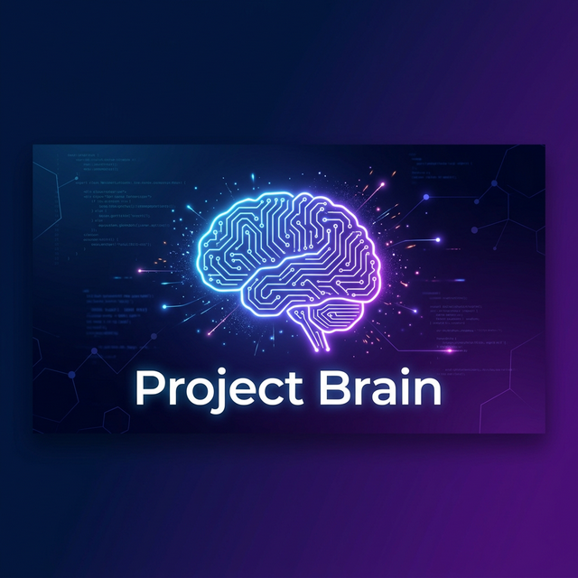

<p align="center">
  
</p>

<h1 align="center">Project Brain</h1>

<p align="center">
  <strong>Stop repeating yourself to AI. Start shipping faster.</strong>
</p>

<p align="center">
  <a href="#installation"></a>
  <a href="https://marketplace.visualstudio.com/items?itemName=ProjectBrain.project-brain"></a>
  <a href="https://marketplace.visualstudio.com/items?itemName=ProjectBrain.project-brain"></a>
  <a href="https://marketplace.visualstudio.com/items?itemName=ProjectBrain.project-brain"></a>
</p>

<p align="center">
  <em>Works with VS Code, Cursor, Windsurf, VSCodium & all VS Code forks</em>
</p>

---

## The Problem Every Developer Faces

You're using AI coding assistants. But every single time:

- "Let me explain my project structure again..."
- "No, that's not how we do authentication here..."
- "You forgot about the coding standards I mentioned 10 prompts ago..."

**You waste 40% of your AI interactions re-explaining context.**

The AI forgets. You repeat. Productivity dies.

---

## The Solution: Give Your AI a Brain

**Project Brain** automatically generates a structured memory system that AI assistants read FIRST before helping you.

```
One-time setup. Permanent context. Zero repetition.
```

### Before Project Brain
```
You: "Add a login button"
AI: *Generates React code when you use Vue*
You: "No, we use Vue here"
AI: *Uses Options API when you use Composition*
You: "We use Composition API"
AI: *Ignores your auth system*
You: *Sighs deeply*
```

### After Project Brain
```
You: "Add a login button"
AI: *Reads your context files*
AI: *Generates perfect Vue 3 Composition API code*
AI: *Integrates with your Supabase auth*
AI: *Follows your exact coding standards*
You: *Ships feature in 2 minutes*
```

---

## What Gets Generated

One command creates your entire AI context system:

```
CLAUDE.md                    <- AI reads this first
project-brain/
  product.md                <- What you're building & why
  architecture.md           <- System design & data flow
  stack.md                  <- Your exact tech stack
  coding-standards.md       <- Your code style rules
  agent-rules.md            <- How AI should behave
  database.md               <- Schema & relationships
  api.md                    <- Endpoints & contracts
  roadmap.md                <- Current priorities
```

**Every AI tool that supports context files will understand your project instantly.**

---

## Works Everywhere

| IDE | Status |
|-----|--------|
| VS Code | Full Support |
| Cursor | Full Support |
| Windsurf | Full Support |
| VSCodium | Full Support |
| Any VS Code Fork | Full Support |

| AI Tool | Compatibility |
|---------|--------------|
| Claude Code | Native |
| Cursor AI | Native |
| GitHub Copilot | Compatible |
| Cody | Compatible |
| Continue | Compatible |

---

## Installation

### From Marketplace (Recommended)

1. Open VS Code / Cursor / Windsurf
2. Go to Extensions (`Ctrl+Shift+X`)
3. Search **"Project Brain"**
4. Click **Install**
5. Done. Open any project and click the brain icon.

### From VSIX

Download the latest `.vsix` from [Releases](https://github.com/project-brain/vscode-extension/releases) and install manually.

---

## Quick Start (60 Seconds)

1. **Open your project**
2. **Click the brain icon** in the sidebar
3. **Click "Initialize Project Brain"**
4. **Answer 4 simple questions** about your project
5. **Done.** Your AI now understands everything.

<p align="center">
  
</p>

---

## Smart Detection

Project Brain automatically detects your stack:

- **package.json** -> Node.js, React, Vue, Angular, Next.js, etc.
- **requirements.txt** -> Python, FastAPI, Django, Flask
- **Cargo.toml** -> Rust
- **go.mod** -> Go

The wizard pre-fills everything. You just confirm.

---

## Features

### Sidebar Panel
Quick access to all brain files. See status at a glance.

### Setup Wizard
Guided 4-step process. No guesswork.

### Auto-Sync
Add new files to `project-brain/`? Imports update automatically.

### Regenerate
Project evolved? One click to rebuild `CLAUDE.md`.

### Stack Templates
Framework-specific templates that match your conventions.

---

## Commands

Open Command Palette (`Ctrl+Shift+P`) and type:

| Command | Description |
|---------|-------------|
| `Project Brain: Initialize` | Launch setup wizard |
| `Project Brain: Regenerate Claude.md` | Rebuild main context file |
| `Project Brain: Sync` | Update all imports |

---

## FAQ

**Q: Does this slow down my IDE?**
A: No. It activates on startup, checks for files, then sleeps. Zero performance impact.

**Q: What if I already have a CLAUDE.md?**
A: We detect it and won't overwrite. You can manually regenerate if you want.

**Q: Does it work offline?**
A: 100%. Everything is local. No external calls. No telemetry.

**Q: Can I customize the templates?**
A: Yes. Edit any generated file. Your changes are preserved on sync.

---

## Why Developers Choose Project Brain

> "I was mass-prompting context in every conversation. This fixed it permanently."
> — *Senior Developer at a Fortune 500*

> "Setup took 45 seconds. Now Claude actually understands my monorepo."
> — *Startup CTO*

> "The agent-rules.md alone saved me hours of AI debugging nonsense."
> — *Solo Indie Hacker*

---

## The Math

| Without Project Brain | With Project Brain |
|----------------------|-------------------|
| 5 min context per AI chat | 0 min context |
| 10 AI chats per day | 10 AI chats per day |
| **50 min wasted daily** | **0 min wasted** |
| **4+ hours wasted weekly** | **0 hours wasted** |

**That's 200+ hours per year you're getting back.**

---

## Open Source & Free Forever

- MIT Licensed
- No accounts
- No tracking
- No premium tier
- Just productivity

---

## Contributing

PRs welcome. See [CONTRIBUTING.md](CONTRIBUTING.md).

```bash
git clone https://github.com/project-brain/vscode-extension
cd vscode-extension
npm install
npm run watch
# Press F5 to launch Extension Development Host
```

---

## Star History

If this saves you time, star the repo. It helps others find it.

<p align="center">
  <a href="https://github.com/project-brain/vscode-extension/stargazers">
    
  </a>
</p>

---

<p align="center">
  <strong>Stop explaining. Start shipping.</strong>
</p>

<p align="center">
  <a href="https://marketplace.visualstudio.com/items?itemName=ProjectBrain.project-brain">
    
  </a>
</p>

---

<p align="center">
  Made with focus by developers who got tired of repeating themselves.
</p>
